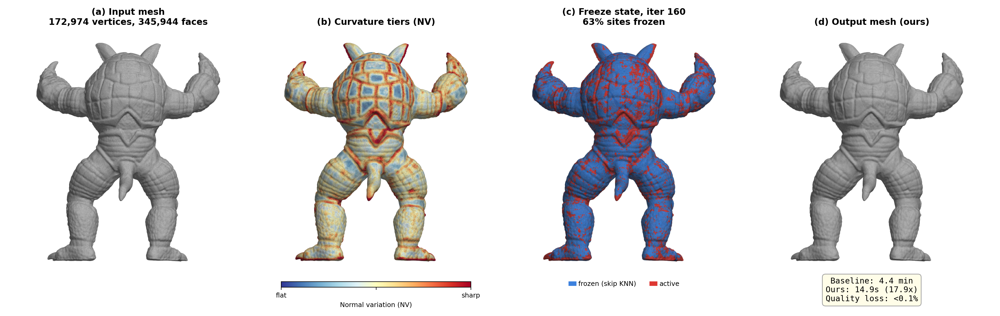

# 1. Introduction

## Plan

| Para | Content | Tone |
|------|---------|------|
| 1 | CVT produces highest element quality among non-learning methods; Lloyd iteration is the solver; GPU is natural fit | Concrete, factual |
| 2 | The bottleneck: KNN dominates GPU cost; all prior methods recompute it for every site every iteration; this makes GPU CVT lose to CPU Delaunay at scale | Problem, clear stakes |
| 3 | **Teaser figure description** — walk the reader through Figure 1 (a)→(d), making the method visually intuitive before any technical detail | Accessible, visual |
| 4 | Our key observation: most sites converge early, but *safely detecting* convergence is the hard part — curvature causes oscillation and neighbor decoupling; naive freeze fails | Insight, sets up the challenge |
| 5 | Our solution: curvature-adaptive freeze + reusable KNN — one sentence each, confident | Solution, direct |
| 6 | Results: 3–10× over Geogram on 8 meshes; scales to 2.8M vertices where prior GPU CVT is impractical; quality within 0.1% | Numbers, let results speak |
| 7 | Contributions (4 items) | Crisp |

---

> 
>
> **Figure 1.** Overview of our method on the Armadillo mesh (172,974 vertices). *(a)* Input mesh. *(b)* Per-site curvature tiers computed from normal variation (NV): flat regions (blue) converge quickly and can be frozen early; sharp regions (red) oscillate and require longer proof of convergence. *(c)* Freeze state at iteration 160: 63\% of sites are frozen (blue, skip KNN) while active sites (red) remain near high-curvature features where convergence is slowest. *(d)* Output mesh produced by our method — visually indistinguishable from the unfrozen baseline, with less than 0.1\% quality loss, completed in 14.9 seconds versus 4.4 minutes for the brute-force baseline (17.9$\times$ speedup).

---

Centroidal Voronoi tessellation (CVT) produces the highest element quality among non-learning isotropic remeshing methods by minimizing a well-defined energy functional [Du et al. 1999]. Given a set of sites distributed on a triangle mesh, CVT iteratively moves each site to the centroid of its Voronoi cell until the sites are optimally spaced, then extracts the dual triangulation. The resulting meshes consist of nearly equilateral triangles, which is critical for finite-element simulation, texture atlas generation, and geometry processing pipelines where downstream algorithms require well-shaped elements. The standard solver is Lloyd iteration [Lloyd 1982], which repeats four steps per site: find the $K$ nearest neighboring sites, construct the local Voronoi cell in the tangent plane, compute the cell centroid, and project it back onto the surface.

Lloyd iteration is embarrassingly parallel — each site's update is independent — making it a natural fit for GPU acceleration. However, a critical bottleneck limits scalability: the $K$-nearest-neighbor (KNN) query that every site performs at every iteration accounts for 60–80\% of total GPU time. All prior GPU CVT methods, from jump flooding [Rong et al. 2011] to restricted tangent faces (RTF) [Yao et al. 2023] and curvature-adaptive clipping [Fei et al. 2025], recompute KNN for every site at every iteration regardless of whether that site has already converged. On small meshes (under 50K vertices), GPU parallelism masks this redundancy. But as meshes grow to hundreds of thousands of vertices, the cumulative cost of redundant KNN queries dominates runtime, and GPU CVT becomes slower than well-optimized CPU methods based on Delaunay triangulation [Lévy and Liu 2010]. This scaling wall has limited practical GPU CVT to meshes of at most 30K–50K sites in prior work.

Figure 1 illustrates our approach on the Armadillo mesh (173K vertices). Panel (a) shows the input mesh. Panel (b) visualizes per-site curvature tiers: flat regions (blue) where the tangent-plane approximation is accurate and sites converge quickly, versus sharp regions (red) where curvature distorts the Voronoi computation and sites oscillate persistently. Panel (c) shows the freeze state at iteration 160 — 63\% of sites have been identified as converged and removed from KNN queries (blue), while the remaining active sites (red) cluster near high-curvature features where convergence is genuinely incomplete. Panel (d) shows the output mesh, visually indistinguishable from the unfrozen baseline, produced in 14.9 seconds versus 4.4 minutes for the brute-force baseline.

The key to making this work is recognizing that *detecting* convergence is harder than it appears, and that surface curvature is the governing factor. In flat regions, sites converge monotonically: when a site stops moving, its neighbors stop too, and a brief period of low displacement reliably signals convergence. In curved regions, the tangent-plane approximation introduces centroid bias that causes sites to oscillate rather than settle. Worse, neighboring sites oscillate with independent phases — a site may momentarily pause while its neighbors continue moving, reshuffling the KNN set. Displacement alone cannot distinguish a genuine convergence from a transient pause in oscillation. A naive freeze policy that treats all sites uniformly produces a 64\% false-freeze rate at curved regions, locking sites into incorrect positions and visibly degrading mesh quality.

We address this with two synergistic components. First, a *curvature-adaptive freeze policy* that tests two conditions simultaneously — low displacement (the site has stopped moving) and stable KNN topology (the neighborhood has settled) — and requires both to hold for a curvature-dependent number of consecutive iterations before freezing a site. Flat sites freeze after 10 consecutive passes; sharp sites require 30. This reduces false-freeze rates from 64\% to below 2\%. Second, a *reusable bitonic KNN structure* that translates the growing frozen fraction into proportional GPU speedup: frozen sites are compacted out of the query set before dispatch (ensuring full warp occupancy on the remaining active queries), previous KNN results warm-start each iteration's search, and periodic refresh bounds accumulated stale-KNN error.

We evaluate on 11 meshes spanning 35K to 2.84M vertices. On 8 meshes ranging from 35K to 544K vertices, it is 3.1–10.4$\times$ faster than Geogram RVD-CVT [Lévy and Liu 2010] — the leading CPU implementation — when both methods run 250 Lloyd iterations with matched site counts, while producing comparable element quality ($Q_{\mathrm{avg}} \approx 0.917$ vs. 0.929). On 3 large meshes (1.2–2.8M vertices), where prior GPU CVT methods and CPU baselines are impractical, our freeze policy achieves 3.7–4.2$\times$ speedup over KNN reuse alone, reducing the Samothrace mesh (2.84M vertices) from 16.7 minutes to 4.0 minutes. Across all 11 meshes, quality metrics track the unfrozen baseline within 0.1\%. To our knowledge, this is the first demonstration of KNN-based GPU CVT at million-vertex scale with competitive runtime.

Our contributions are:

1. **A curvature-driven analysis of convergence difficulty in surface CVT.** We identify two mechanisms — centroid bias from tangent-plane distortion causing oscillation, and convergence decoupling among neighbors at high curvature — that explain why naive convergence detection fails, and quantify both across 11 meshes.

2. **A curvature-adaptive dual-gate freeze policy.** A freeze test combining displacement stability and KNN topology stability with curvature-scaled streak requirements, reducing false-freeze rates from 64\% to below 2\% while progressively freezing 50–97\% of sites.

3. **A reusable bitonic KNN structure with freeze-aware compaction.** A hub-grid KNN backend supporting frozen-mask compaction, warm-starting, and periodic refresh, ensuring that the freeze policy's sparsity translates into proportional wall-clock speedup on GPU.

4. **GPU CVT at unprecedented scale.** We demonstrate 3–10$\times$ speedup over Geogram on meshes up to 544K vertices, and effective CVT remeshing on meshes up to 2.84M vertices — 10–50$\times$ beyond the scale of prior GPU CVT evaluations — with negligible quality loss.
