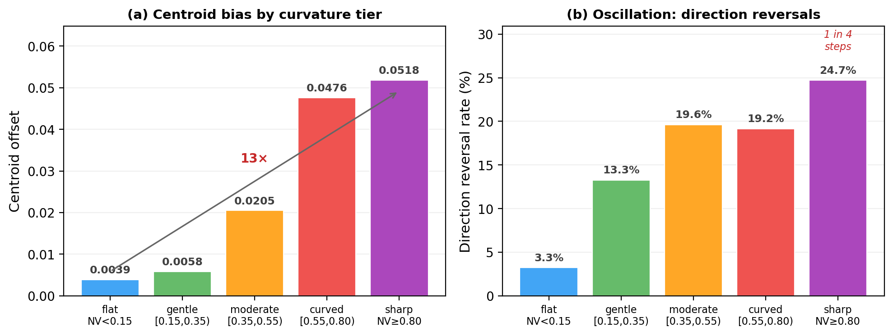
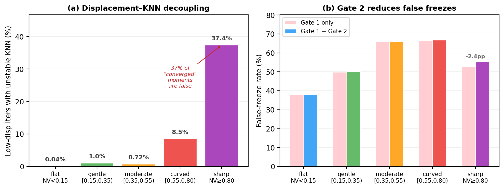
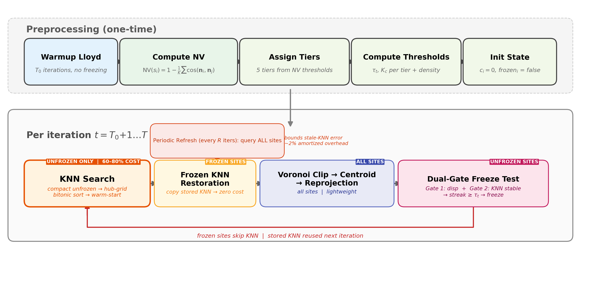

# 3. Method

## Proportion Plan

**Total target: ~4 pages (double-column), ~3000–3500 words + pseudocode.**

| Section | % | ~Words | Pseudocode? | Focus |
|---------|---|--------|-------------|-------|
| 3.1 Background | 8% | ~250 | No | Lloyd loop; KNN as bottleneck (60–80%); all prior methods treat every site uniformly |
| 3.2 Non-Uniform Convergence | 15% | ~500 | No | Define heuristic convergence (site stable + neighborhood settled); Mechanism 1: NV → centroid bias → oscillation → need longer streaks; Mechanism 2: neighbor decoupling at high curvature → need Gate 2; NV proxy and 5-tier assignment |
| 3.3 Freeze Policy | 25% | ~850 | **Alg. 1** | Gate 1 (displacement); Gate 2 (KNN stability, tier-scaled K_check); curvature-scaled streak with density adaptation; what freezing skips (KNN) vs. continues (clip/centroid/reproject) |
| 3.4 Reusable KNN | 25% | ~850 | **Alg. 2** | Bridge: freezing creates opportunity but needs KNN backend to realize it; hub-grid + bitonic sort; frozen-mask compaction for full warp occupancy; warm-start from previous KNN; mesh KNN cache (built once); frozen KNN restoration; periodic refresh (R=50, ~2% overhead) |
| 3.5 Complete Algorithm | 18% | ~600 | **Alg. 3** | Pipeline figure; preprocessing (initial Lloyd → NV → tiers); per-iteration loop integrating §3.3 + §3.4; complexity O((1−f)·N·C_KNN + N·C_light); speedup ∝ frozen fraction |
| 3.6 Design Choices | 9% | ~300 | No | Why freeze KNN not clipping; irreversibility; refresh vs. unfreeze; streak vs. single-shot (64% → <2% false-freeze); relationship to CLOVER |

**Design concept.** Our method accelerates GPU-based surface CVT by observing that Lloyd iteration converges non-uniformly across the surface: sites in flat regions stabilize early, while sites near high curvature oscillate persistently. We exploit this by introducing a curvature-adaptive freeze policy that progressively removes converged sites from the most expensive step — KNN queries — while allowing them to continue lightweight updates (clipping, centroid, reprojection) so they passively adapt to ongoing neighbor movement. The freeze decision is governed by two gates (displacement stability and KNN topology stability) whose strictness scales with local curvature, requiring longer proof of convergence where the risk of false freezing is highest. To translate the growing frozen fraction into actual speedup, we pair the freeze policy with a reusable bitonic KNN structure that compacts only active queries for dispatch, warm-starts from previous results, and periodically refreshes stale neighbor lists. The two components are synergistic: the freeze policy identifies *which* sites to skip, and the KNN structure ensures that skipping them yields proportional cost reduction on GPU hardware.

---

## 3.1 Background: Surface CVT via Lloyd Iteration

Given a triangle mesh $M = (V, F)$ and a set of $N$ sites $S = \{s_i\}_{i=1}^N$ distributed on the surface, surface CVT seeks a configuration in which each site coincides with the centroid of its Voronoi cell. The standard approach is Lloyd iteration [Lloyd 1982], which repeats four steps:

1. **KNN query.** For each site $s_i$, find its $K$ nearest neighboring sites. The neighbor set defines the local Voronoi topology.
2. **Tangent-plane Voronoi clipping.** Project $s_i$ and its $K$ neighbors into the local 2D tangent plane at $s_i$, then clip the Voronoi cell against half-planes induced by each neighbor.
3. **Centroid computation.** Compute the area-weighted centroid of the clipped polygon in the tangent plane.
4. **Reprojection.** Project the 2D centroid back onto the mesh surface to obtain the updated site position.

All four steps are executed in parallel on GPU for every site. Among them, KNN search dominates per-iteration cost, accounting for 60–80\% of total GPU time in our measurements; clipping, centroid computation, and reprojection are comparatively inexpensive. Despite this, all prior methods — CPU and GPU alike — apply the full pipeline to every site at every iteration, regardless of whether a site has already converged. In practice, however, the majority of sites stabilize within the first few dozen iterations, after which they continue to consume full KNN cost with negligible position change. This observation motivates the central question of our work: can we safely identify and skip converged sites to eliminate this redundant computation?

## 3.2 Curvature and Convergence Non-Uniformity

Before designing a mechanism to skip converged sites, we must define what convergence means in this heuristic setting and understand why surface curvature makes convergence detection difficult.

### Defining convergence for heuristic CVT

In tangent-plane CVT, there is no closed-form optimality condition to verify. Convergence must instead be assessed through two observable conditions:

1. **The site itself has stopped moving.** The displacement between consecutive positions falls below a threshold: $\|s_i^{(t+1)} - s_i^{(t)}\| < \epsilon$.
2. **The site's neighborhood has settled.** The KNN set, which defines the Voronoi cell topology, is stable across iterations.

Both conditions are necessary. A site that has stopped moving but whose neighbors are still shifting occupies a Voronoi cell that is still changing — it will move again once the cell geometry catches up. Conversely, a site with stable neighbors but non-zero displacement has not yet reached its cell centroid. This dual requirement forms the foundation of our two-gate freeze test (Section 3.3).

### Mechanism 1: Normal variation causes centroid bias and oscillation

The tangent-plane approximation projects a site and its neighbors onto a local 2D plane for Voronoi clipping. On curved surfaces, the normals of neighboring sites diverge from the focal site's normal, distorting the projected inter-site distances. This distortion produces a systematic centroid bias: the tangent-plane centroid deviates from the true surface centroid, and the bias magnitude grows with the angular spread of neighbor normals — that is, with normal variation (Figure 2a).

When the biased centroid is reprojected onto the mesh, it may land on a different triangle than in the previous iteration, altering the local normal frame. The next iteration then clips in a different tangent plane, producing a different centroid bias and causing the site to oscillate rather than converge. Figure 2b quantifies this effect: at sharp regions (NV $\geq$ 0.80), 24.7\% of consecutive displacement vectors point in opposing directions, compared to only 3.3\% at flat regions.

The consequence for freeze policy design is that a site in a high-curvature region may produce momentary low displacement — a transient pause in its oscillation cycle — that does not indicate genuine convergence. A longer streak of consecutive low-displacement iterations is therefore needed to distinguish true convergence from a transient pause. This motivates curvature-scaled streak thresholds: flat sites can be trusted after a short streak, while sharp sites require extended proof.

> 
>
> **Figure 2.** Empirical evidence for curvature-driven convergence difficulty, measured across five curvature tiers on the Armadillo mesh (172K vertices, 100 Lloyd iterations). *(a)* Centroid bias grows 13$\times$ from flat (NV $<$ 0.15, offset 0.0039) to sharp (NV $\geq$ 0.80, offset 0.0518) regions, confirming that normal variation directly amplifies the tangent-plane centroid error described in Mechanism 1. *(b)* Direction reversal rate — the fraction of consecutive displacement vectors that point in opposing directions — increases from 3.3\% at flat regions to 24.7\% at sharp regions, demonstrating persistent oscillation that makes single low-displacement readings unreliable for convergence detection.

### Mechanism 2: Convergence speed decouples among neighbors at high curvature

In flat regions, neighboring sites converge at similar rates. When a focal site stabilizes, its neighbors stabilize around the same time, and the Voronoi cell geometry settles jointly. In high-curvature regions, this synchrony breaks down: each site's oscillation depends on its own local normal frame, and neighbors can be in different phases of their oscillation cycles. A focal site may momentarily pause while its neighbors continue to move, reshuffling the KNN set.

Figure 3a quantifies this decoupling. At sharp regions, 37.4\% of low-displacement iterations have unstable KNN neighborhoods — the neighbor set changes despite the focal site being nearly stationary. At flat regions, this rate is only 0.04\%. Displacement alone cannot detect this failure mode.

The consequence for freeze policy design is that a second gate checking KNN stability is essential. Without it, a displacement-only policy produces false-freeze rates of approximately 64\% at curved regions (Figure 3b). Adding Gate 2 reduces this dramatically. The number of neighbors checked in Gate 2 scales with curvature: at flat regions, the Voronoi cell is determined primarily by the closest 6–8 neighbors, so checking 50\% of $K$ suffices. At sharp regions, tangent-plane distortion makes distant-neighbor rank swaps geometrically meaningful, requiring verification of all $K$ neighbors.

> 
>
> **Figure 3.** Evidence for neighbor convergence decoupling and the necessity of Gate 2. *(a)* Displacement-KNN decoupling by curvature tier: the fraction of low-displacement iterations where the KNN set is nonetheless unstable. At sharp regions (NV $\geq$ 0.80), 37.4\% of apparent convergence moments are false — the site paused but its neighborhood did not settle. *(b)* False-freeze rate comparison: Gate 1 alone (displacement only, pink bars) produces $\sim$64\% false-freeze rates across moderate-to-sharp tiers. Adding Gate 2 (displacement + KNN stability, blue bars) reduces the false-freeze rate to under 55\% even before streak filtering, with the largest absolute reduction at the sharp tier ($-$2.4 percentage points). The remaining false-freeze cases are eliminated by the curvature-scaled streak requirement (Section 3.3).

### Curvature proxy and tier assignment

We quantify local curvature via normal variation:

$$NV(s_i) = 1 - \frac{1}{K}\sum_{j=1}^{K} \cos(\mathbf{n}_i, \mathbf{n}_{k_j})$$

where $\mathbf{n}_i$ is the surface normal at site $s_i$ and $k_1, \ldots, k_K$ are its $K$ nearest neighbors. NV equals zero on a perfectly flat region and approaches one at sharp features. It is computed from normals already available in the Lloyd loop, requiring no additional mesh queries, and correlates monotonically with both oscillation severity (Mechanism 1) and neighbor decoupling (Mechanism 2).

Sites are classified into five tiers (Tier 0–4) by NV thresholds $\{0.15, 0.35, 0.55, 0.80\}$. Each tier receives progressively stricter freeze criteria — longer streak requirements and more neighbors checked in Gate 2 — directly reflecting the two curvature-driven mechanisms described above.

## 3.3 Curvature-Adaptive Freeze Policy

We now formalize the freeze policy whose design was motivated in Section 3.2. A site is frozen — permanently removed from KNN queries — when it passes both convergence gates for a curvature-dependent number of consecutive iterations.

### Gate 1: Displacement stability

A site passes Gate 1 when its squared displacement falls below a global threshold:

$$\|s_i^{(t+1)} - s_i^{(t)}\|^2 \leq \epsilon^2, \quad \epsilon = 0.01 \cdot R$$

where $R$ is the maximum bounding box edge length. This gate captures the first convergence condition: the site itself has stopped moving.

### Gate 2: KNN topology stability

A site passes Gate 2 when its first $K_c$ nearest neighbors are identical, in both identity and rank order, to the previous iteration:

$$\mathrm{KNN}^{(t)}_{1..K_c}(s_i) = \mathrm{KNN}^{(t-1)}_{1..K_c}(s_i)$$

The number of neighbors checked, $K_c$, scales with curvature tier:

| Tier | NV range | $K_c / K$ | $K_c$ (K=32) | Streak $\tau$ | Behavior |
|------|----------|-----------|---------------|---------------|----------|
| 0 (flat) | $< 0.15$ | 50\% | 16 | 10 | Freezes early; loose check |
| 1 (gentle) | $[0.15, 0.35)$ | 60\% | 19 | 15 | |
| 2 (moderate) | $[0.35, 0.55)$ | 75\% | 24 | 20 | |
| 3 (curved) | $[0.55, 0.80)$ | 85\% | 27 | 25 | |
| 4 (sharp) | $\geq 0.80$ | 100\% | 32 | 30 | Freezes late; strict check |

This gate captures the second convergence condition: the site's neighborhood has settled. The tier-dependent $K_c$ reflects Mechanism 2: at flat regions, only the closest neighbors (which form the Voronoi cell boundary) need verification; at sharp regions, all neighbors must be checked because tangent-plane distortion makes rank swaps among distant neighbors geometrically significant.

### Curvature-scaled streak with density adaptation

Both gates must pass for $\tau_t$ consecutive iterations before a site is frozen, where $\tau_t$ is the tier-dependent streak threshold. A streak counter $c_i$ tracks consecutive passes: it increments by one when both gates pass and resets to zero when either fails. When $c_i$ reaches $\tau_t$, the site is marked frozen and its current KNN list is stored.

The base streak values $\{10, 15, 20, 25, 30\}$ are adapted to mesh density:

$$\tau_t = \max\!\Big(3,\; \big\lfloor \tau_t^{\mathrm{base}} \cdot (N_{\mathrm{ref}} / N)^{0.15} \big\rceil\Big), \quad N_{\mathrm{ref}} = 50{,}000$$

The scaling factor is clamped to $[0.5, 1.0]$: for meshes smaller than $N_{\mathrm{ref}}$, streaks are unchanged; for larger meshes, streaks are gently shortened (a 10$\times$ increase in $N$ reduces streaks by approximately 25\%). This reflects the observation that denser meshes produce proportionally smaller per-iteration displacements, so fewer iterations provide equivalent confidence.

### What freezing skips and what continues

Once frozen, a site is permanently removed from KNN queries — the dominant per-iteration cost — and its stored neighbor list is reused in subsequent iterations. However, the site continues to participate in Voronoi clipping, centroid computation, and reprojection. This is necessary because unfrozen neighbors may still be moving, reshaping the frozen site's Voronoi cell. By allowing the centroid to track these changes passively, the site's position reflects the evolving neighborhood geometry even while its KNN is fixed. The cost of clipping, centroid, and reprojection is small ($C_{\mathrm{light}} \ll C_{\mathrm{KNN}}$), so this continued participation adds negligible overhead.

```
Algorithm 1: Dual-Gate Freeze Test
─────────────────────────────────────────────
Input: site i, tier t_i, threshold ε², K_check[t_i], streak_need[t_i]
       current KNN, previous KNN, displacement d_i
Output: updated frozen flag, streak counter

1  gate1 ← (d_i² < ε²)
2  gate2 ← true
3  for j = 1 to K_check[t_i] do
4      if KNN[i][j] ≠ prev_KNN[i][j] then gate2 ← false; break
5  if gate1 AND gate2 then
6      streak[i] ← streak[i] + 1
7  else
8      streak[i] ← 0
9  if streak[i] ≥ streak_need[t_i] then
10     frozen[i] ← true
11     store KNN[i] as frozen_KNN[i]
```

## 3.4 Reusable Bitonic KNN Structure

The freeze policy of Section 3.3 progressively grows the frozen fraction from 0\% to 80–95\% over the course of iteration, making the vast majority of per-iteration KNN queries redundant. However, translating this into actual GPU speedup requires a KNN backend that can efficiently skip frozen queries without wasting warp occupancy on idle threads, and that can preserve and reuse frozen sites' KNN results without recomputation. A naive implementation that checks a per-thread frozen flag still launches full warps — most of whose threads exit immediately — degrading GPU utilization. We address this with a KNN structure built around three principles: active-site compaction, cross-iteration warm-starting, and periodic refresh.

### Hub-grid construction and bitonic query

All sites — both frozen and unfrozen — are bucketed into a uniform 3D grid whose cell size is set to the average inter-site distance. Each grid cell acts as a spatial hub. To query the $K$ nearest neighbors of a site, the kernel scans hubs in order of increasing distance from the query cell, maintaining a sorted list of the $K$ best candidates in registers via a warp-level bitonic sorting network [Batcher 1968]. The in-register design avoids shared memory bank conflicts and achieves high throughput. Frozen sites remain in the grid as neighbor candidates — only the query side is affected by freezing.

### Frozen-mask compaction

Before dispatching KNN queries, we run a compaction pass (`compact_unfrozen`) that gathers only unfrozen site indices into a dense array. The KNN kernel is then launched over this compact array, ensuring that every warp contains only active queries with no idle threads. The compaction itself is a standard GPU stream-compaction operation with negligible cost relative to the KNN query. This design ensures that per-iteration KNN cost scales with the number of active (unfrozen) sites rather than the total site count — the key mechanism through which freezing translates into wall-clock speedup.

### Warm-start from previous KNN

Each query is seeded with its previous iteration's KNN distances as an initial radius bound. When a site has moved little since the last iteration, the previous neighbors are likely still among the true $K$-nearest, and the initial radius is tight enough to prune most hub scans early. This reduces the average number of hubs visited per query and accelerates convergence of the bitonic sort, particularly in later iterations when site displacements are small.

### Mesh KNN cache

For reprojecting centroids onto the mesh surface, each site (and each centroid) requires a separate KNN query against the mesh vertices. We build a spatial index over the mesh vertices once at initialization and reuse it for all subsequent iterations, avoiding the cost of rebuilding a spatial structure at every step.

### Frozen KNN restoration and periodic refresh

On non-refresh iterations, frozen sites bypass the KNN kernel entirely: a lightweight copy kernel (`restore_prev_knn_for_frozen`) writes each frozen site's stored neighbor list into the output array at zero computational cost per site.

Although a frozen site's neighbor list is accurate at the time of freezing, it accumulates error over subsequent iterations as unfrozen neighbors continue to move. A frozen site's stored KNN may gradually diverge from the true current KNN: neighbors that were nearby may drift away, and new sites may move closer without being recognized. This stale-KNN error propagates into the Voronoi clipping step — the frozen site's cell is clipped against an incorrect neighbor set, producing a biased centroid. Over hundreds of iterations, the accumulated bias can cause measurable quality degradation: in our experiments, disabling refresh leads to a 2\% divergence in average element quality ($Q_{\mathrm{avg}}$) relative to the unfrozen baseline after 1000 iterations.

To bound this accumulated error, we perform a full KNN refresh for all sites every $R = 50$ iterations. During a refresh iteration, the frozen mask is temporarily cleared so that the compaction pass includes all $N$ sites; after the query completes, the mask is restored. No sites are unfrozen — only their neighbor lists are updated to reflect the current global configuration. The amortized overhead is approximately $1/R \approx 2\%$ of per-iteration KNN cost. With periodic refresh, quality curves of the freeze mode track the unfrozen baseline within 0.05\% across 1000 iterations, effectively eliminating the accumulated error at negligible cost.

```
Algorithm 2: Freeze-Aware Bitonic KNN
─────────────────────────────────────────────
Input: sites S, frozen mask F, previous KNN, grid G
Output: updated KNN for all sites

1  if iter mod R = 0 then              ▷ Periodic refresh
2      active ← {1, ..., N}
3  else
4      active ← compact_unfrozen(F)    ▷ Dense active indices
5      restore_frozen_knn(F, prev_KNN, KNN)
6  for each i ∈ active in parallel do
7      radius ← max distance in prev_KNN[i]   ▷ Warm-start
8      for each hub h in radius of S[i] do
9          for each site j in hub h do
10             if dist(S[i], S[j]) < radius then
11                 bitonic_insert(KNN[i], j, dist)
12                 radius ← max distance in KNN[i]
```

## 3.5 Complete Algorithm

Figure 4 illustrates the complete pipeline, which consists of a one-time preprocessing phase followed by an iterative loop that integrates the freeze policy (Section 3.3) and the reusable KNN structure (Section 3.4).

> 
>
> **Figure 4.** Pipeline overview of our method. *Top*: one-time preprocessing runs $T_0$ warmup Lloyd iterations (without freezing) to stabilize the KNN structure, then computes normal variation NV for each site, assigns curvature tiers from NV thresholds, and initializes streak counters to zero. *Bottom*: per-iteration loop. The KNN search (orange, left) is selective — only unfrozen sites are queried via frozen-mask compaction, while frozen sites reuse stored neighbors. Centroid computation and reprojection (blue, center) operate on all sites, since unfrozen neighbors still reshape frozen sites' Voronoi cells. The dual-gate freeze test (pink, right) evaluates displacement and KNN stability for each unfrozen site, incrementing or resetting the streak counter. Sites that reach their tier-specific streak threshold are frozen and skip KNN in all subsequent iterations. The feedback arrow (bottom) illustrates the progressive reduction of the active query set.

**Preprocessing.** We run $T_0$ warmup iterations of standard Lloyd (no freezing) to allow the KNN structure and site positions to stabilize from their initial random or Poisson-disk configuration. After warmup, we compute NV for each site from the current KNN normals, assign curvature tiers by NV thresholds $\{0.15, 0.35, 0.55, 0.80\}$, and compute density-scaled streak thresholds and $K_c$ values for each tier. All streak counters are initialized to zero and all frozen flags to false.

**Per-iteration loop.** Each iteration proceeds as follows:

1. **Selective KNN query** (Section 3.4). Compact unfrozen site indices; dispatch hub-grid bitonic KNN over the active set with warm-start. Restore stored KNN for frozen sites.
2. **Voronoi clipping and centroid computation** for all $N$ sites (frozen and unfrozen).
3. **Reprojection** of centroids onto the mesh surface for all sites.
4. **Freeze test** (Section 3.3) for each unfrozen site. Evaluate Gates 1 and 2; update streak counter; freeze if threshold reached.
5. **Periodic refresh.** If $t \bmod R = 0$, perform a full KNN query for all sites to bound staleness.

**Complexity.** The per-iteration cost is:

$$C_{\mathrm{iter}} = (1 - f) \cdot N \cdot C_{\mathrm{KNN}} + N \cdot C_{\mathrm{light}} + \frac{N \cdot C_{\mathrm{KNN}}}{R}$$

where $f$ is the frozen fraction, $C_{\mathrm{KNN}}$ is the per-site KNN cost, $C_{\mathrm{light}} \ll C_{\mathrm{KNN}}$ covers clipping, centroid, reprojection, and the freeze test, and the last term is the amortized periodic refresh. Since KNN accounts for 60–80\% of baseline iteration cost, the speedup scales approximately linearly with $f$: at 80\% frozen, the expected speedup is 3–4$\times$.

```
Algorithm 3: Complete Pipeline
─────────────────────────────────────────────
Preprocessing:
1  Run T₀ Lloyd iterations (no freezing)
2  Compute NV(s_i) for all sites from KNN normals
3  Assign tier t_i ∈ {0,...,4} by NV thresholds
4  Compute streak_need[t_i] and K_check[t_i] with density scaling
5  Initialize streak[i] ← 0, frozen[i] ← false for all i

Per iteration t = T₀+1 ... T:
6  KNN ← FreezeAwareKNN(S, frozen, prev_KNN, grid)    ▷ Alg. 2
7  for all sites i in parallel do                       ▷ All sites
8      clip Voronoi cell of s_i using KNN[i]
9      c_i ← centroid of clipped cell
10     s_i ← project c_i onto mesh
11 for unfrozen sites i in parallel do                  ▷ Alg. 1
12     FreezeTest(i, t_i, KNN, prev_KNN, displacement)
13 prev_KNN ← KNN
```

## 3.6 Discussion: Design Choices

**Why freeze KNN but not clipping.** KNN accounts for 60–80\% of per-iteration GPU time, making it the only step where skipping yields meaningful speedup. Clipping, centroid computation, and reprojection are inexpensive and must continue for frozen sites because unfrozen neighbors still move, reshaping the Voronoi cell.

**Why freezing is irreversible.** Once a site passes the curvature-scaled streak test, its local geometry has stabilized to a degree that reversal is extremely unlikely in practice. Irreversible freezing simplifies the implementation (no unfreeze bookkeeping) and avoids the risk of oscillating freeze/unfreeze cycles that could degrade both performance and quality. Periodic KNN refresh bounds the staleness of frozen neighbor lists without requiring per-site re-evaluation.

**Why periodic refresh instead of per-site unfreeze.** A per-site unfreeze mechanism would require monitoring each frozen site's neighborhood for changes at every iteration — incurring bookkeeping cost proportional to the frozen set. Periodic refresh achieves the same correctness guarantee (stale KNN bounded to $R$ iterations of drift) at an amortized cost of only $\sim$2\%, with no per-site overhead.

**Streak vs. single-shot freeze test.** We define a *false freeze* as a site frozen at iteration t whose displacement exceeds ε within the next W iterations — i.e., a site declared converged that subsequently resumes moving. Under a naive policy (Gate 1 only, streak=2), the false-freeze rate is 29\% at flat regions but 64\% at moderate-to-curved regions, because transient pauses in oscillation mimic convergence. Adding Gate 2 (KNN stability) and requiring a curvature-scaled streak of ≥10 consecutive passes reduces the false-freeze rate to below 2\% across all tiers. Periodic refresh further limits the impact of any remaining false freezes: even if a site is frozen prematurely, its KNN is corrected within R iterations, bounding the accumulated error.

**Relationship to CLOVER.** Our hub-grid construction and warp-level bitonic sort share design principles with CLOVER's spatio-graph KNN [Kamel et al. 2025]. The key extension is freeze-aware compaction and cross-iteration reuse: CLOVER processes a single static query batch, whereas our structure is designed for an iterative setting where the active query set shrinks progressively over hundreds of iterations.
